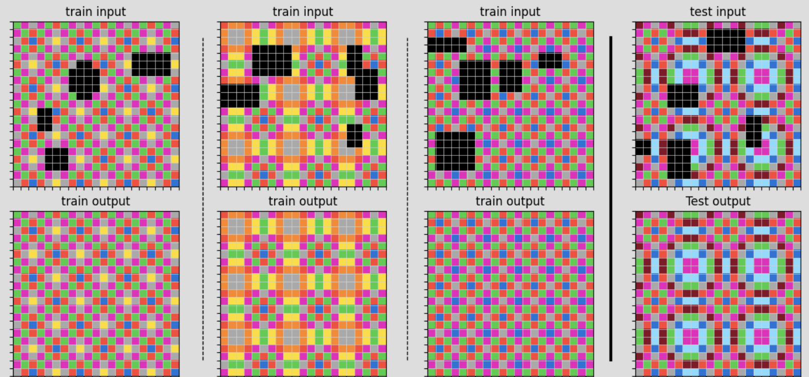
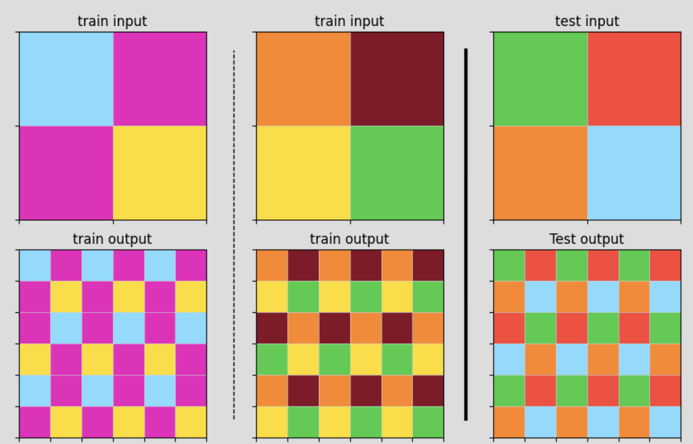

# ARC Solver - Multi-Strategy Abstract Reasoning Solution

A Python framework for solving ARC (Abstract Reasoning Corpus) tasks using multiple specialized algorithms and C++ optimizations, winning SILVER Prize in Kaggle 2024 ARC Competition.

## 🏗️ Architecture

```
arc_solver/
├── solvers/          # 40+ specialized pattern solvers
├── cpp/             # C++ optimized implementations  
├── core/            # Main orchestration logic
└── utils/           # Support functions and transforms
```

## 📁 Project Structure

```
arc_solver/
├── solvers/        # 40+ specialized pattern solvers
├── cpp/           # C++ optimized implementations  
├── core/          # Main orchestration logic
├── utils/         # Support functions and transforms
└── data/          # Task handling structures
```

### Core Components
- **Solvers**: DAG, Tiling, Symmetry, Chess, ML, Grid, Color Counter
- **C++ Extensions**: pybind11 bindings for performance-critical algorithms
- **Utilities**: Pattern detection, transforms, visualization, ML functions
- **Data**: Task structures and processing pipelines

## 🚀 Quick Start

```python
from arc_solver import ArcSolver

# Initialize solver
solver = ArcSolver()

# Load and solve task
task = solver.load_task("path/to/task.json")
result = solver.solve(task)

# Get predictions
predictions = result.get_predictions()
```

## 🛠️ Installation

```bash
# Basic installation
pip install -r requirements.txt

# Development installation with C++ optimizations
pip install -e .
cd arc_solver/cpp && python setup.py build_ext --inplace
```

### Prerequisites
- Python 3.8+
- C++ compiler (GCC 7+ or Clang 5+) for optimizations
- CMake 3.15+ for C++ builds

## 📋 Solving Process

### 1. Task Analysis
```python
# Automatic pattern detection
solver.analyze_task(task)  # → identifies task type
```

### 2. Solver Selection
```python
# Multi-strategy approach
if dag_solver.can_solve(task):
    return dag_solver.solve(task)
elif tiling_solver.can_solve(task):
    return tiling_solver.solve(task)
# ... fallback chain
```

### 3. Transform Pipeline
```python
# Example: Object removal task
transforms = [
    "filterCol_0",      # Remove black pixels
    "extractPattern",   # Learn background pattern  
    "fillHoles",        # Fill empty regions
    "replicate"         # Reconstruct background
]
```

## 📖 **[🔥 Detailed Solving Examples →](EXAMPLES.md)**

See comprehensive examples of how our solver handles:
- **Object Removal & Background Reconstruction** (DAGSolver)
- **Pattern Tiling & Expansion** (TilingSolver)
- **Solver Selection Strategies**
- **Advanced Configuration & Usage**

## 💡 Solving Examples

### Example 1: Object Removal & Background Reconstruction



**Problem**: Remove black shapes from colorful backgrounds and intelligently fill the holes.

**Solver**: DAGSolver
**Process**:
1. **Pattern Recognition**: Identifies black pixels (color 0) as removal targets
2. **Background Analysis**: Learns surrounding color patterns  
3. **Transform Sequence**: `filterCol_0` → `extractPattern` → `fillHoles` → `replicate`
4. **Result**: Clean background with natural hole filling

```python
dag_solver = create_balanced_dag_solver()
if dag_solver.can_solve(task):
    results = dag_solver.solve(task)  # Returns multiple candidates
```

### Example 2: Pattern Tiling & Expansion



**Problem**: Expand 2×2 color pattern into 6×6 grid through systematic tiling.

**Solver**: TilingSolver
**Process**:
1. **Size Detection**: Recognizes 2×2 → 6×6 (3× expansion ratio)
2. **Pattern Extraction**: Identifies fundamental tile structure
3. **Tiling Application**: Uses `np.tile(pattern, (3, 3))`
4. **Result**: Perfect 6×6 tiled output

```python
tiling_solver = TilingSolver()
if tiling_solver.can_solve(task):
    results = tiling_solver.solve(task)  # Returns tiled pattern
```

### Solver Selection Strategy

| Task Type | Recommended Solver | Key Features |
|-----------|-------------------|--------------|
| **Object Removal** | DAGSolver | Multi-step transforms, hole filling |
| **Pattern Tiling** | TilingSolver | Size ratio detection, systematic repetition |
| **Symmetry Tasks** | SymmetrySolver | Reflection, rotation, symmetry repair |
| **Chess Patterns** | ChessSolver | Periodic grids, checkerboard detection |

## 📊 Performance

| Metric | Value |
|--------|-------|
| Solver Types | 40+ specialized algorithms |
| C++ Speedup | 4x-46x over pure Python |
| Success Rate | Variable by task complexity |
| Processing Time | ~1s average per task |

## 🔧 Configuration

```python
# Custom solver configuration
config = SolverConfig(
    max_depth=20,
    enable_cpp=True,
    timeout=30,
    max_candidates=5
)
solver = ArcSolver(config=config)
```

## 🚀 Deployment

### Local Development
```bash
git clone <repository>
cd arc-solver
pip install -e .
python -c "import arc_solver; print('Ready!')"
```

### Production
```bash
# Install from PyPI
pip install arc-solver

# Or build from source
python -m build
pip install dist/arc_solver-*.whl
```

### Docker
```dockerfile
FROM python:3.9-slim
WORKDIR /app
COPY requirements.txt .
RUN pip install -r requirements.txt
COPY . .
RUN pip install -e .
ENTRYPOINT ["python", "-m", "arc_solver.cli"]
```

## 🧪 Testing

```bash
# Run test suite
python -m pytest tests/

# Test specific solver
python -m pytest tests/test_tiling_solver.py
```

## 📖 Technical Details

### Transform Functions
- **Geometric**: rotation, reflection, scaling
- **Color**: filtering, mapping, inversion  
- **Pattern**: extraction, replication, filling
- **Composition**: layering, masking, alignment

### DAG Search Strategy
1. **State Representation**: Grid + metadata
2. **Transform Application**: Function chaining
3. **Candidate Generation**: Multiple solution paths
4. **Scoring**: Confidence-based ranking

---

**Note**: This solver framework combines heuristic algorithms, pattern recognition, and performance optimization to tackle ARC reasoning tasks systematically.


