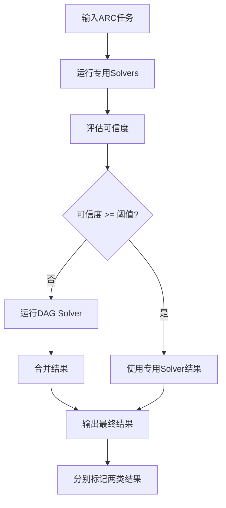

# DAG Solver Fallback逻辑修改

## 🎯 修改目标

按照您的要求，修改arc_solver的主函数处理逻辑，让DAG solver作为fallback机制：

1. **优先使用专用solver**: 首先运行除DAG之外的所有专用solver
2. **评估可信度**: 如果专用solver产生高可信度答案，直接使用
3. **DAG fallback**: 如果没有高可信度答案，启用DAG solver作为backup
4. **分别输出**: 输出中包含两类solver的最佳答案，分别标识

## 📝 具体修改内容

### 1. 核心逻辑修改 (`core/solver.py`)

#### **数据结构扩展**
```python
@dataclass
class SolverResult:
    # 原有字段
    task_id: str
    predictions: List[np.ndarray]
    scores: List[float]
    solver_contributions: Dict[str, List[np.ndarray]]
    metadata: Dict[str, Any]
    
    # 新增字段
    dag_predictions: Optional[List[np.ndarray]] = None  # DAG solver结果
    specialist_predictions: Optional[List[np.ndarray]] = None  # 专用solver结果
    used_fallback: bool = False  # 是否使用了fallback
```

#### **Solver组织**
```python
def _initialize_solvers(self):
    # 专用solvers (非DAG)
    self.specialist_solvers = {
        'repeating': RepeatingSolver(),
        'chess': ChessSolver(),
        'tiling': TilingSolver(),
        # ... 其他专用solver
    }
    
    # DAG solver (fallback)
    self.dag_solver = DAGSolver(
        max_depth=self.config.dag_max_depth,
        enable_logging=self.config.dag_enable_logging
    )
```

#### **核心求解逻辑**
```python
def solve(self, task: Task) -> SolverResult:
    # Step 1: 运行专用solvers
    specialist_candidates = []
    for solver_name, solver in self.specialist_solvers.items():
        candidates = solver.solve(task)
        if candidates:
            specialist_candidates.extend(candidates)
    
    # Step 2: 评估专用solvers的可信度
    specialist_selected, specialist_scores = self.candidate_selector.select(specialist_candidates)
    has_high_confidence = any(score >= self.config.dag_high_confidence_threshold 
                             for score in specialist_scores)
    
    # Step 3: 条件性运行DAG solver
    if not has_high_confidence and self.dag_solver:
        dag_results = self.dag_solver.solve(task)
        # ...处理DAG结果
    
    # Step 4: 决定最终输出
    if has_high_confidence:
        # 使用专用solver结果
        final_predictions = specialist_selected
    else:
        # 优先DAG结果，补充专用solver结果
        final_predictions = dag_selected + specialist_selected[...]
```

### 2. 配置系统扩展 (`core/config.py`)

```python
@dataclass
class SolverConfig:
    # 原有配置...
    
    # DAG solver相关配置
    enable_dag_solver: bool = True  # DAG solver作为fallback
    dag_high_confidence_threshold: float = 15.0  # 专用solver可信度阈值
    dag_max_depth: int = 20
    dag_enable_logging: bool = False
```

### 3. 输出格式增强 (`cli.py`)

```python
# 输出包含分类结果
output_data[task_id] = {
    'predictions': [...],  # 最终选择的结果
    'scores': [...],
    'dag_predictions': [...],  # DAG solver的结果
    'specialist_predictions': [...],  # 专用solver的结果  
    'used_fallback': bool,  # 是否使用了fallback
    'metadata': {
        'primary_source': 'dag_solver' | 'specialist_solvers',
        'specialist_max_score': float,
        'dag_max_score': float,
        # ...其他元数据
    }
}
```

### 4. CLI增强

- 支持`dag`参数在`--solvers`中
- verbose输出显示fallback使用统计
- 详细展示各solver的评分情况

## 🔧 核心工作流程



## ⚙️ 配置示例

### 高可信度场景 (不触发fallback)
```python
config = SolverConfig()
config.dag_high_confidence_threshold = 5.0  # 低阈值，容易满足
# 专用solver评分超过5.0就不会使用DAG
```

### 低可信度场景 (触发fallback)  
```python
config = SolverConfig()
config.dag_high_confidence_threshold = 50.0  # 高阈值，难以满足
# 专用solver评分低于50.0就会启用DAG fallback
```

### 禁用DAG fallback
```python
config = SolverConfig()
config.enable_dag_solver = False
# 完全禁用DAG solver，只使用专用solvers
```

## 📊 输出格式示例

### 使用专用solver (高可信度)
```json
{
  "task_001": {
    "predictions": [[1,0],[0,1]],
    "scores": [18.5],
    "specialist_predictions": [[1,0],[0,1]], 
    "dag_predictions": null,
    "used_fallback": false,
    "metadata": {
      "primary_source": "specialist_solvers",
      "specialist_max_score": 18.5,
      "dag_max_score": 0.0
    }
  }
}
```

### 使用DAG fallback (低可信度)
```json
{
  "task_002": {
    "predictions": [[0,1],[1,0]],
    "scores": [12.3],
    "specialist_predictions": [[1,1],[0,0]],
    "dag_predictions": [[0,1],[1,0]],
    "used_fallback": true,
    "metadata": {
      "primary_source": "dag_solver", 
      "specialist_max_score": 8.2,
      "dag_max_score": 12.3
    }
  }
}
```

## 🎉 预期效果

1. **智能fallback**: 只在需要时才使用计算昂贵的DAG solver
2. **结果透明**: 清楚地知道结果来源于哪类solver
3. **可配置**: 可以调整可信度阈值来控制fallback策略
4. **性能优化**: 避免不必要的DAG计算
5. **兼容性**: 保持与现有API的兼容性

## 🔍 关键优势

- **效率**: 优先使用快速的专用solver
- **质量**: DAG solver作为通用backup保证覆盖率  
- **透明**: 输出明确标识结果来源
- **灵活**: 可配置的触发阈值
- **渐进**: 不破坏现有的solver架构

这种修改实现了您要求的逻辑：先用专用solver，评估可信度，必要时启用DAG fallback，并分别输出两类solver的最佳答案。 